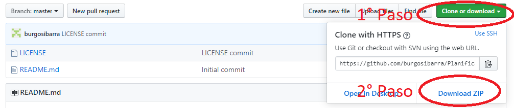
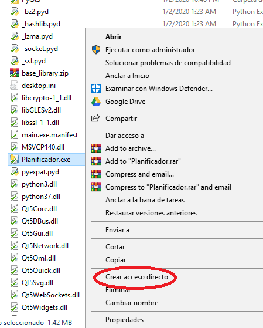
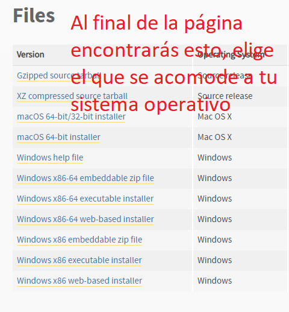

# Planificador de malla curricular :page_with_curl: :school: :white_check_mark: :x:

## ¿Como descargar?

### Paso 1:
Haz click en ```Clone or download``` y luego en ```Download ZIP```


### Paso 2, opción 1 (Solo para Windows):
* Descomprime el archivo descargado y elimina todo menos la carpeta ```Planificador```
* Abres la carpeta y haz click en el archivo ```Planificador.exe``` (o solo ```Planificador```) y listo!
* **Nota**: Puedes crear un acceso directo de este archivo (haciendo click derecho sobre este) y ubicar este ```main.exe - Acceso directo``` donde tu quieras


### Paso 2, opción 2 (Válido para cualquier usuario, advertencia: es un poco complejo pero no imposible):
* Paso 2.1: Installa Python 3.7.x (puede ser 3.7.1, 3.7.2, etc.), para ello puedes visitar https://www.python.org/downloads/release/python-374
    * **Importante**: Cerca del final de la instalación debes clickear el checkbox que dice Add Python 3.7 to PATH



* Paso 2.2: Abre tu "Terminal" o "Comandos del sistema"
    * Para MAC: https://es.wikihow.com/abrir-una-ventana-de-%22Terminal%22-en-Mac
    * Para Windows: https://es.wikihow.com/abrir-la-l%C3%ADnea-de-comandos-en-Windows

* Paso 2.3: Installa PyQt5
    * Para ello debes escribir ```pip3 install pyqt5```
    * **Nota**: si no funciona intenta ```pip install pyqt5```

* Paso 2.4: Descomprime el archivo descargado y elimina todo menos la carpeta ```Programa en Python```
    * Abre el archivo ```main.py``` y ejecutalo
-------
